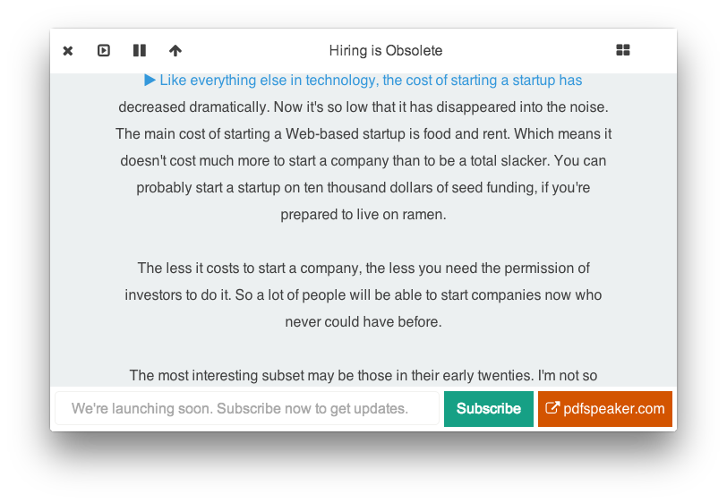

## PdfSpeaker  (Experimental) (MacOnly) ##
Start listening to your pdf files (experimental). For now, text files.

PdfSpeaker utilises mac osx's native text-to-speech functionality
to read aloud pdf/text files. The pdf-to-text conversion feature isn't
ready yet.



## How to Build ##
```
git clone https://github.com/hemantasapkota/pdfspeaker.git
cd src
npm install
bower install
chmod +x buildRun.sh
./buildRun.sh
```

## Technologies ##
* [Node Webkit ( Now known as nw.js )](https://github.com/nwjs/nw.js/)
* [NodeJS](http://nodejs.org/)
* [Famous](https://github.com/Famous/famous)
* HTML / CSS / JS ( Usual stuffs )

## Default Text Included ##
* [Hiring Is Obsolete](http://www.paulgraham.com/hiring.html)
* [How To Make Wealth](http://www.paulgraham.com/wealth.html)
* [How To Start A Startup](http://www.paulgraham.com/start.html)
* [Startup Lessons](http://paulgraham.com/startuplessons.html)
* [The Unreasonable Effectiveness of C](http://damienkatz.net/2013/01/the_unreasonable_effectiveness_of_c.html)
* [Git Flow Atlassian](https://www.atlassian.com/git/tutorials/comparing-workflows/feature-branch-workflow)
